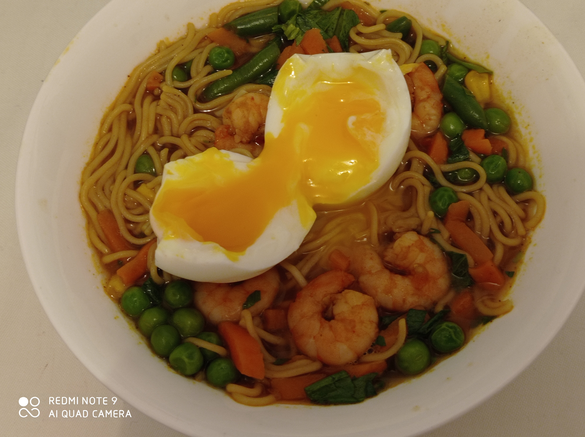

# London 10 Recipe Book

## Abdi Mohamed

## Bekir

## Khalil alhaydr

## Hussein Bahdon

## Mahendra Balal

## Elena Barker

## Rebecca Champion

## Olha Danylevska

## Mehmetomer demir

## Shadi Fakhri

## Adrian Ilovan

## Andrius Isin

## Saqib Javed

## Saim Korkmaz

## J Lama

## Damilola odumosu

## Bedi Omuri

## Stella Del Mar Rodriguez Fernandez

## Ahmed Saif

## Jan Softa

## Anu Thapaliya

## Karley Webster

## Paulina Wywrot

## Jonathan Z

## Anna

## Danny

## K -One

## Hamda Abdi

## Shahid Amin

## Onur Atas

## Afsoon Davari

## Kristina Dudnyk

## Jarrod Folino

## Navid Hejazi

## Yulia Hospodar

## Afsha Hossain

Healthy Ramen
Ramen is a Japnaese noodle dish. I love making this healthy ramen. It is easy to prepare and also super delicous. You should try it too. 😄

Ingredients
For Noodles
Brown rice ramen noodles (I do 4 cups of water for 2 noodle cakes)
2 cups of frozen or fresh veggies
Prawns
Optional: fresh parsley to garnish
For Seasoning
2 tsp veggie stock
1 tsp garlic powder
1 tsp onion powder
½ tsp Chinese 5 spice powder
¼ tsp cumin
¼ tsp turmeric
Salt and pepper to taste
2 tbsp tamari sauce
Instructions
Bring water to boil, add spices, once boiling, add ramen cakes.
Once noodles are 90% cooked, add in frozen veggies & prawns.
Allow to simmer for a few mins until everything is cooked.
Garnish with fresh parsley if desired and enjoy!

## J Lama

## Maksim Lukianenko

## Iryna Lypnyk

## Beko Meigag

## Pouya Nasraei

## Saliha Popal

## Rihanna Poursoltani

## Danny Elena Romero

## Cal Tanner

## Baki Tuncer
